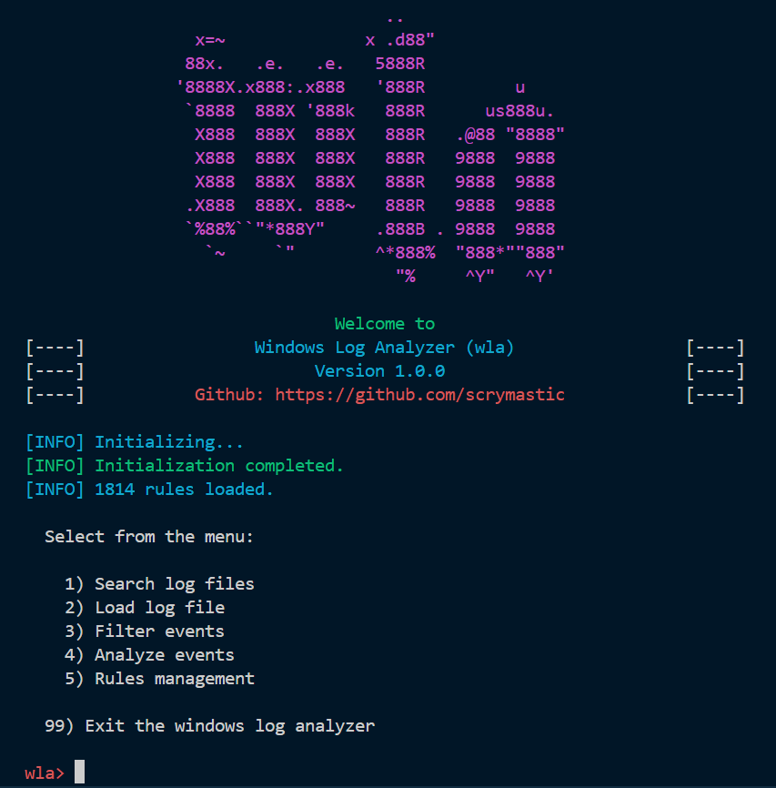

# windows-log-analyzer


This is a Python tool for parsing evtx files, analyzing them, and filtering suspicious events using Sigma rules.

## Installation

To install the tool, follow these steps:

1. Clone the repository:

    ```shell
    git clone https://github.com/scrymastic/windows-log-analyzer.git
    ```

2. Install the required dependencies:

    ```shell
    pip install -r requirements.txt
    ```

## Usage

To use the tool, run the following command:

```shell
python -m main
```



Configure the tool by editing the `config.py` file.


## Contributing

Contributions are welcome. Feel free to open an issue or submit a pull request.

## Acknowledgements

Parts of this project use resources from other open source repositories.

The following is a list of these projects:

- [sigma](https://github.com/SigmaHQ/sigma): a repository of Sigma rules for detecting suspicious events.

- [EVTX-ATTACK-SAMPLES](https://github.com/sbousseaden/EVTX-ATTACK-SAMPLES): a repository of evtx files collected from various attack scenarios.


